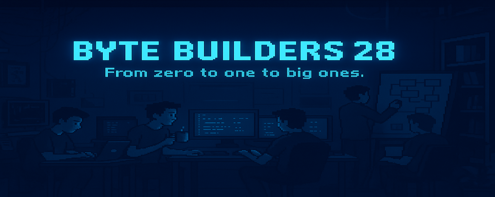

# ⚡ Byte Builders 28

> From zero to one to big ones.

---

### 🎯 Overview

**Byte Builders 28** is a 2028 batch developer team focused on building, breaking, and improving systems through hackathons and real-world projects.
We explore, create, and innovate across multiple domains — wherever good ideas meet strong execution.

---

### 🧠 Focus Areas

* 🤖 Artificial Intelligence & Machine Learning
* 🎮 Game Development
* 🛡️ Cybersecurity
* 🌐 Internet of Things (IoT)
* ⛓️ Blockchain & Smart Contracts
* 🧩 Hackathon Projects & Prototypes
* 🧱 Research, Tools, and Experiments

---

### 👥 Team Members

1. **Anirban Sarkar** — Leader / Project Manager 

   * GitHub: [AnirbansarkarS](https://github.com/AnirbansarkarS)

2. **Soumabha Mahapatra** — Blockchain & Frontend Developer

   * GitHub: [TechEruption](https://github.com/TechEruption)

3. **Rishabh Chatterjee** — Robotics Engineer

   * GitHub: [Ri2004](https://github.com/Ri2004)

4. **Sandipan Das** — Cyber Security Specialist & Frontend

   * GitHub: [Sandipan-developer](https://github.com/Sandipan-developer)

5. **Darsan Ghosh (XpolioN)** — Game Developer & Data Science 

   * GitHub: [XpolioN2005](https://github.com/xpolion2005)

---

### 🚀 Vision

To create technology that starts small and scales fast — from ideas to impact.

---

### 🧩 Foundation

Batch of 2028 • Built on logic, learning, and late nights.
 
Established: 5 July 2025

